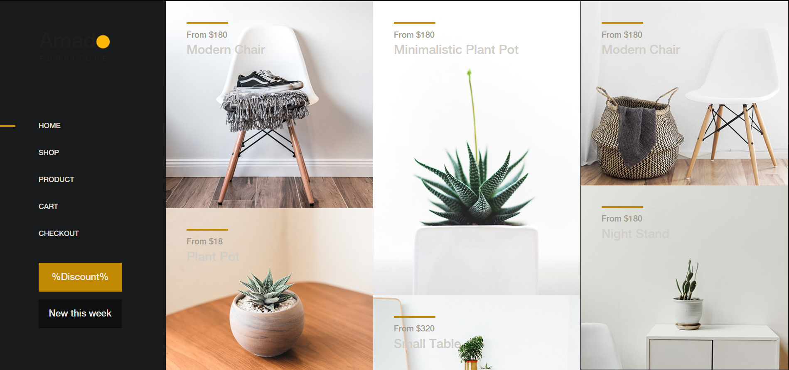
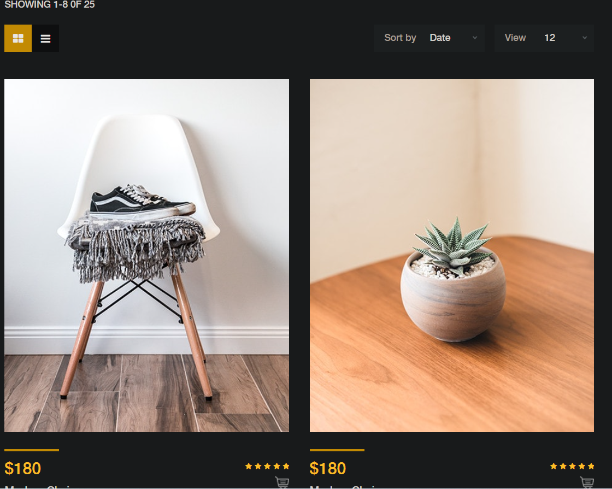
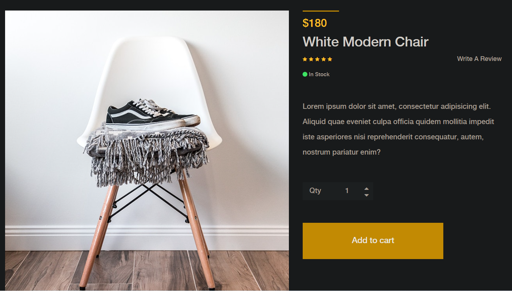
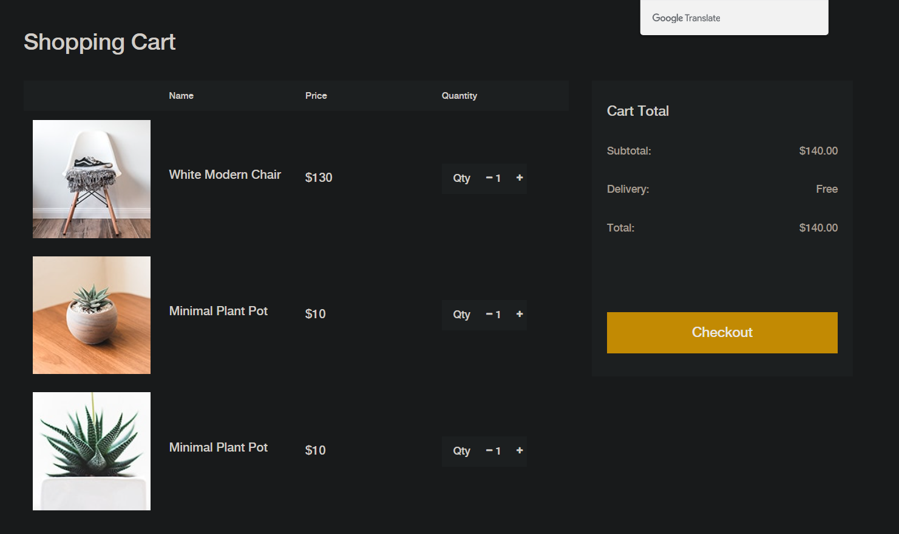
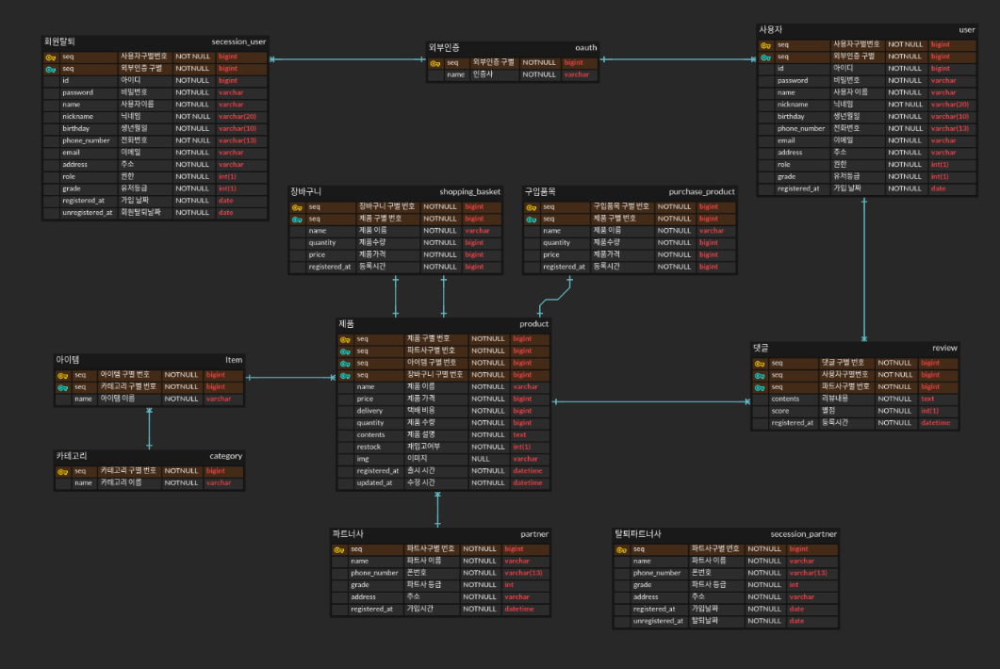

# 주문관리 API 서비스 개발 (only Backend)

### 기술스텍

- java 8
- springBoot 2.x
- JPA
- gradle
- Junit 5

 

### 운영방안

- 간단한 디자인으로 만들어진 front에 RestAPI를 만든다.
- 평일 하루 2시간 이상 작업할 것

### 서비스 개발 아이디어 노트

어떤 식으로 서비스를 만들지에 대한 아이디어를 생각 날 때마다 기록한다.

### 디자인 방식

 

#### 메인화면

#### category세부사항

#### 작품세부사항

#### 제품검색

#### 장바구니목록

### 데이터 베이스 설계

[데이터베이스](https://www.erdcloud.com/p/zMWLrNEfYetdZqaLd)

### 연동 방식

- H2 database에 연동한다.

#### 그 외

[기획_노션](https://www.notion.so/API-f69af0f2826a46e9a6368063e670b1fe)
