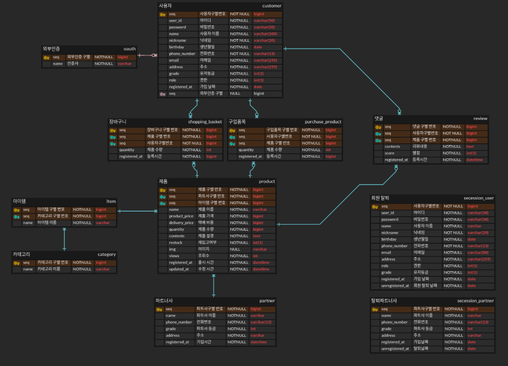

# 주문관리 API 서비스 개발 (only Backend)

### 기술스텍
- java 8
- springBoot 2.x
- JPA
- gradle
- Junit 5
 

### 브랜치 전략
Git Flow를 사용하여 브랜치를 관리한다. 
- Main : 와전히 개발이 끝난 부분에 대해서만 Merge를 진행
- Master : 배포시 사용합니다.
- Feature : 기능 개발을 진행할 때 사용합니다.
- Release : 배포를 준비할 때 사용합니다.

### 요구사항
#### 사용자 테이블
- 아이디(5자 이상 50자 제한), 비밀번호 (8자 이상, 50자 제한) 중복을 허용하지 않는다.
- 닉네임(20자 제한),이름(100자 제한) 중복을 허용하지 않는다.
- 전화번호는 010-0000-0000 형식을 지킨다.
- email은 xxx@xxxx.xxx 형식을 지킨다. - 이메일 인증 확인
- 잘못된 정보는 메세지와 함께 응답을 보낸다.

### 운영방안

- 간단한 디자인으로 만들어진 front에 RestAPI를 만든다.
- 평일 하루 2시간 이상 작업할 것

### 서비스 개발 아이디어 노트

어떤 식으로 서비스를 만들지에 대한 아이디어를 생각 날 때마다 기록한다.

### 데이터 베이스 설계
[데이터베이스](https://www.erdcloud.com/p/zMWLrNEfYetdZqaLd)
  

### 연동 방식
- H2 database에 연동한다.

#### 그 외
[기획_노션](https://www.notion.so/API-f69af0f2826a46e9a6368063e670b1fe)

### 디자인 방식 - 화면 설계
[화면설계](https://ovenapp.io/view/cjwQnaeNnxC3CdwgsHwzedVLXIa1xCdU/) 
  

### RestAPI
##### 사용자 API 요청
JSON 정보 예시 )

    {"userId": "test1asd23",
    "password": "asdfg1234",
    "name": "홍길동",
    "nickname": "길동이",
    "birthday": "2010-02-13",
    "phoneNumber": "010-1234-1454",
    "email": "tsefgt@naver.com",
    "address": "경기도 수원시",
    "grade": "BRONZE",
    "role": 1,
    "registeredAt": "2020-08-23"}

- (GET) http://localhost:8080/customer/{seq} : 사용자 정보 요청
- (GET) http://localhost:8080/customer/all : 사용자 모든 정보 요청
- (POST) http://localhost:8080/customer : 사용자 정보 생성
- (PATCH) http://localhost:8080/customer : 사용자 정보 수정
  : (이름,닉네임,생년월일,전화번호,이메일,주소 만 가능)
- (DELETE) http://localhost:8080/customer/{seq} : 사용자 정보 삭제
